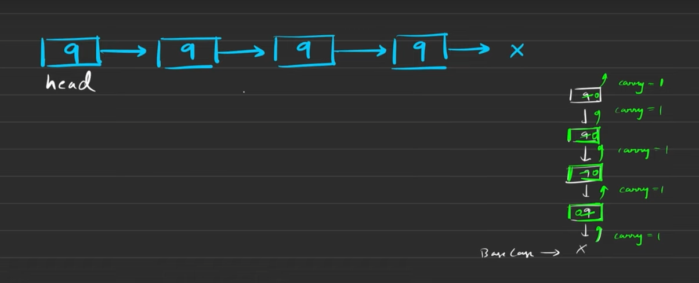

## Problem Statement: 

You're given a positive integer represented in the form of a singly linked-list of digits. The length of the number is 'n'.


Add 1 to the number, i.e., increment the given number by one.


The digits are stored such that the most significant digit is at the head of the linked list and the least significant digit is at the tail of the linked list.


Example:
Input: Initial Linked List: 1 -> 5 -> 2

Output: Modified Linked List: 1 -> 5 -> 3

Explanation: Initially the number is 152. After incrementing it by 1, the number becomes 153.

## Brute Force Approach:

```
// TC --> O(3n)
// SC --> O(1)
head = reverse(head)

temp = head
carry = 1;
while(temp!=NULL){
    temp->data = temp->data + carry
    if(temp>data <10){
        carry =0;
        break;
    }
    else{
        temp->data = 0
        carry = 1
    }

    temp = temp->next;

}

if(carry==1){
    Node newNode = new Node(1)
    head = reverse(head)
    newNode->next = head;
    return newNode;
}

head = reverse(head)

return head;

```

## Optimal Solution:



