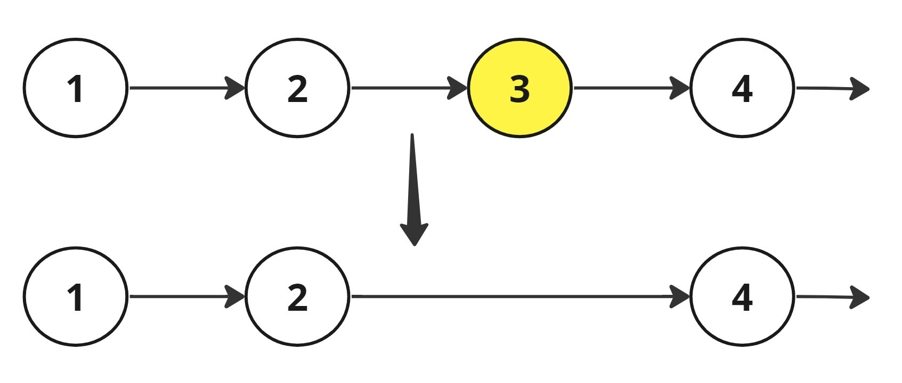

## Problem statement:
You have been given a singly Linked List of 'N' nodes with integer data and an integer 'K'.


Your task is to remove the 'K'th node from the end of the given Linked List and return the head of the modified linked list.


Example:
Input : 1 -> 2 -> 3 -> 4 -> 'NULL'  and  'K' = 2
Output: 1 -> 2 -> 4 -> 'NULL'
Explanation:
After removing the second node from the end, the linked list become 1 -> 2 -> 4 -> 'NULL'.


## BruteForce:

Find length first and then we need to stop our temp one node before the k th position i,e res = length - k and then change the links.

```
Node* delknode(Node* head, int k) {
    Node* temp = head;
    int len = 0;

    // First pass: get the length of the list
    while (temp != NULL) {
        len++;
        temp = temp->next; // O(n)
    }

    // Handle edge cases
    if (k > len || k <= 0) {
        // k is out of bounds; return the original list
        return head;
    }

    // If the node to be deleted is the head
    if (len == k) {
        Node* newHead = head->next;
        delete head;
        return newHead;
    }

    // Find the node to be deleted
    temp = head;
    int target = len - k;
    while (target > 1) {
        temp = temp->next;
        target--;
    }

    // Delete the node
    Node* delNode = temp->next;
    temp->next = delNode->next;
    delete delNode;

    return head;
}

```

## Optimized Solution:

```Suppose K =2 ;
ListNode* removeNthFromEnd(ListNode* head, int n) {
        if(head==NULL || head->next==NULL){
            return NULL;
        }
        ListNode * fast = head;
        ListNode * slow = head;
        for(int i =0;i<n;i++){
            fast = fast->next;
        }
        if(fast==nullptr){
            return head->next;
        }
        while(fast->next!=nullptr){
            slow = slow->next;
            fast = fast->next;
        }
        
        ListNode * delNode = slow->next;
        slow->next = delNode->next;
        delete delNode;
        return head;
        
    }
```

