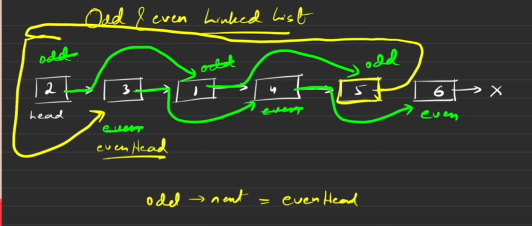

Given the head of a singly linked list, group all the nodes with odd indices together followed by the nodes with even indices, and return the reordered list.

The first node is considered odd, and the second node is even, and so on.


## Brute Force:

Take a temp and start iterating odd indexes and take the data and store it in a array and repeat same for the even indexes 

Now just iterate the given linked list and replace the data with that of the values stored in that of an array 

### Code
```
temp = head
arr[];

if(head!=NULL && head->next!=NULL){
    return head;
}

while(temp!=NULL && temp->next!=NULL){
    arr.add(temp->data);
    temp = temp->next->next;
}

if(temp){
    arr.add(temp->data);
}

// Now repeat the same to iterate over even index

temp = head->next;

while(temp!=NULL && temp->next!=NULL){
    arr.add(temp->data);
    temp = temp->next->next;
}

if(temp){
    arr.add(temp->data);
}

int i = 0 ;
temp = head;

while(temp!=NULL){
    temp->data = arr[i];
    i++;
}

return head;
```

## Optimized:



```
/**
 * Definition for singly-linked list.
 * struct ListNode {
 *     int val;
 *     struct ListNode *next;
 * };
 */
struct ListNode* oddEvenList(struct ListNode* head) {
    if(head==NULL || head->next==NULL){
    return head;
}
struct ListNode *odd = head;
struct ListNode *even = head->next;
struct ListNode *evenHead = head->next; //--> Remember this*

while(even!=NULL && even->next!=NULL){
    odd->next = odd->next->next;
    even->next = even->next->next;
    odd = odd->next;
    even = even->next;
}

odd->next = evenHead;

return head;
    
}

```