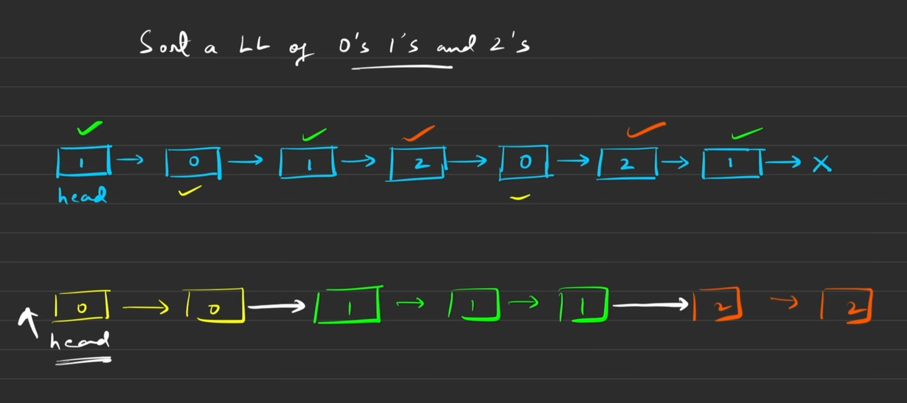
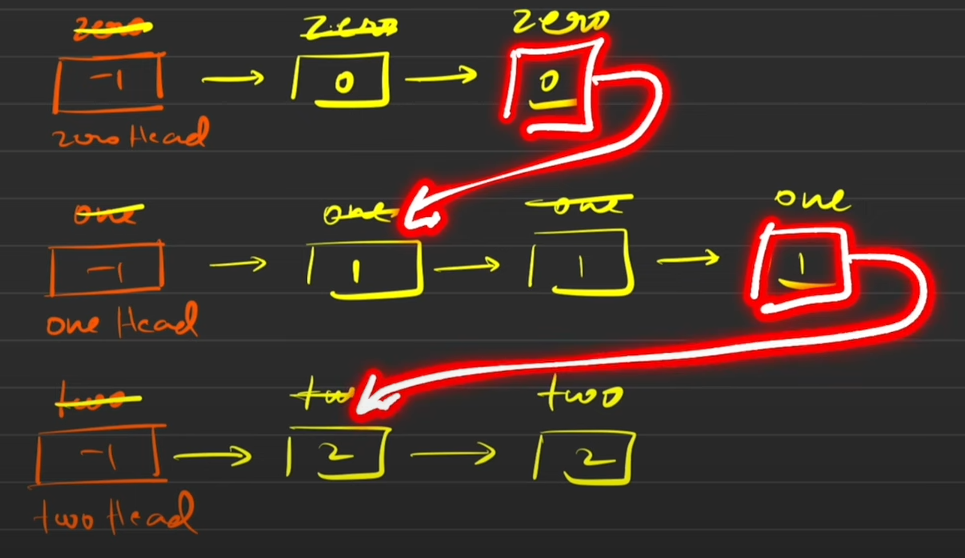

## Problem statement:
Given a linked list of 'N' nodes, where each node has an integer value that can be 0, 1, or 2. You need to sort the linked list in non-decreasing order and the return the head of the sorted list.


### Example:
Given linked list is 1 -> 0 -> 2 -> 1 -> 2. <br> 
The sorted list for the given linked list will be 0 -> 1 -> 1 -> 2 -> 2.

## Brute Force:
```
temp = head;
count0 = 0;
count1 = 0;
count2 = 0;

while(temp!=NULL){
    if(temp->data==0) count0++;
    else if(temp->data==1) count1++;
    else count2++;
    temp = temp->next;
}

temp = head;
while(temp!=NULL){
    if(count0){
    temp->data = 0;
    count--;
    }

    else if(count1){
        temp->data =1;
        count1--;
    }
    else{
        temp->data = 2;
        count2--;
    }

    temp = temp->next;
}

return head;

```
## Optimized Solution:


```
temp = head;
if(head==NULL || temp->next==NULL){
    retrun head;
}
zeroHead = new Node(-1)
oneHead = new Node(-1)
twoHead = new Node(-1)

zero = zeroHead;
one = oneHead;
two = twoHead;

while(temp!=NULL){
    if(temp->data==0){
        zero->next = temp;
        zero = zero->next;
    }
    else if(temp->data==1){
        one->next = temp;
        one = one->next;
    }
    else(temp->data==2){
        two->next = temp;
        two = two->next;
    }
    temp = temp->next;
}

zero->next = (oneHead->next) ? oneHead->next:twoHead->next;
one->next = twoHead->next;
twoHead->next = NULL;

Node *newHead = zeroHead->next;

return newHead;