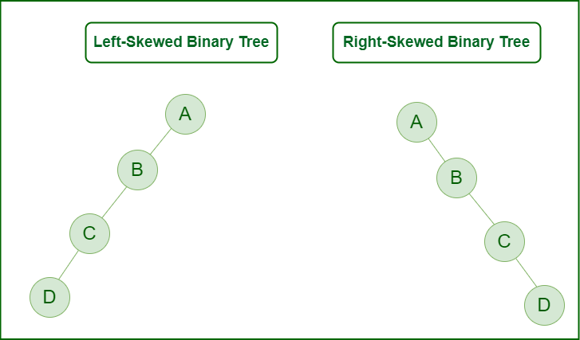
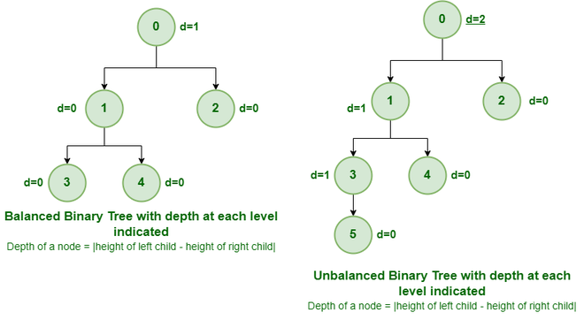

# Binary Tree Data Structure

## Definition
A Binary Tree is a hierarchical data structure in which each node has at most two children, commonly referred to as:
- **Left child**
- **Right child**

It is used in computer science for efficient storage, retrieval, and operations such as:
- **Insertion**
- **Deletion**
- **Traversal**

## Properties
A Binary Tree has the following properties:
- Maximum number of nodes at level `l`: `2^l`
- Height of a tree with `n` nodes: `log(n)`
- Binary trees are widely used in search algorithms and databases.

## Types of Binary Trees Based on the Number of Children

### 1. Full Binary Tree
- Each node has either **0** or **2** children.
- **Parent nodes** or **internal nodes** have either two or no children.
- Known as a **proper binary tree**.

### 2. Degenerate (Pathological) Tree
- Every internal node has only **1 child**.
- Performance is similar to a **linked list**.
- The tree is linear, making it inefficient for certain operations.

### 3. Skewed Binary Tree
- A **pathological tree** where nodes are skewed either to the **left** or **right**.
- Types:
  - **Left-Skewed Tree**: All nodes are aligned to the left.
  - **Right-Skewed Tree**: All nodes are aligned to the right.

## Types of Binary Trees Based on Completion of Levels

### 1. Complete Binary Tree
- All levels are completely filled, except possibly the last level.
- All nodes on the last level are as **left as possible**.
- The tree doesn’t have to be a full binary tree.

### 2. Perfect Binary Tree
- All internal nodes have exactly **two children**.
- All leaf nodes are at the same level.

### 3. Balanced Binary Tree
- The height of the tree is **O(Log n)**, where `n` is the number of nodes.
- Examples:
  - **AVL Tree**: The height difference between left and right subtrees is at most 1.
  - **Red-Black Tree**: Ensures no two consecutive red nodes and equal number of black nodes on all paths.
- Provides **O(log n)** time complexity for search, insert, and delete operations.

